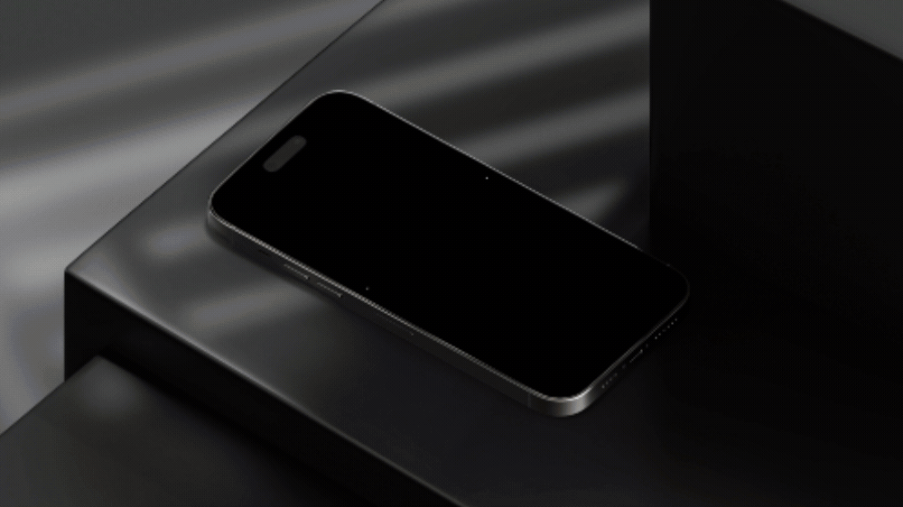
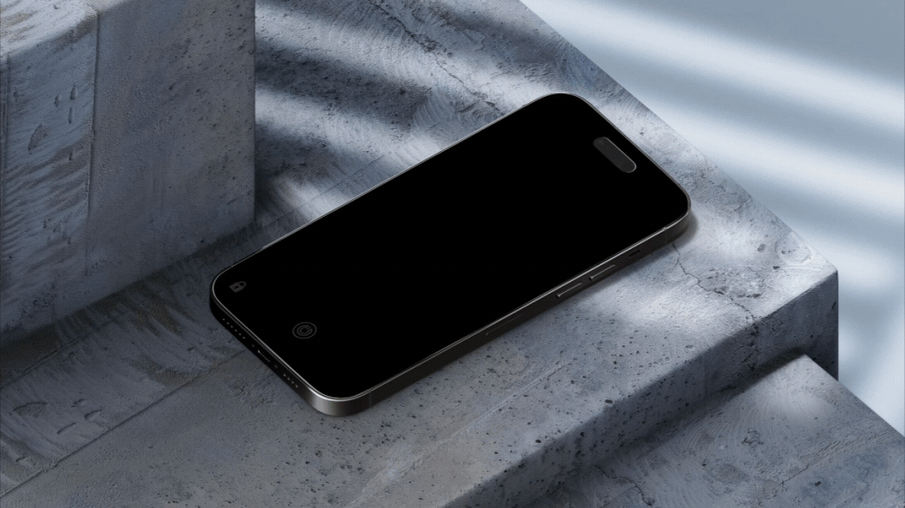
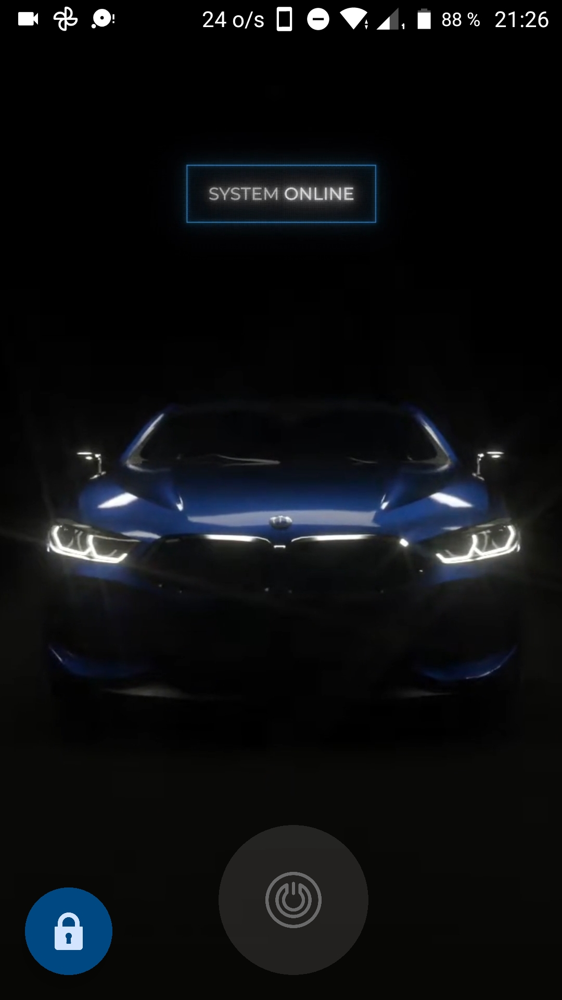
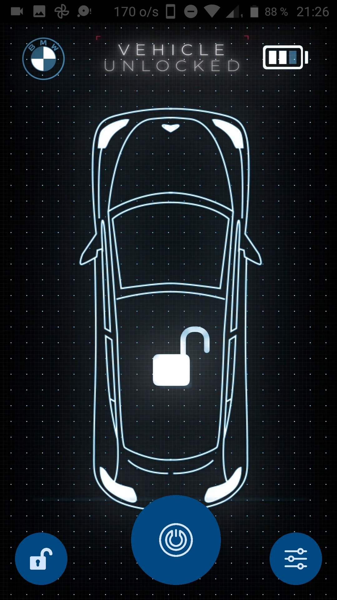
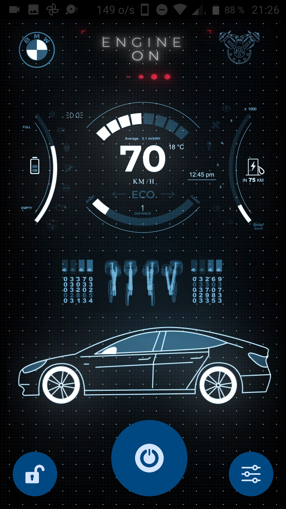
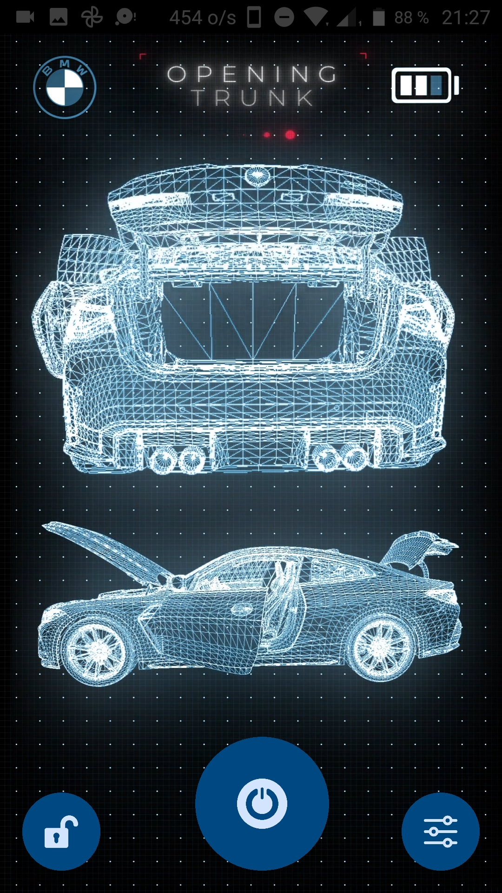
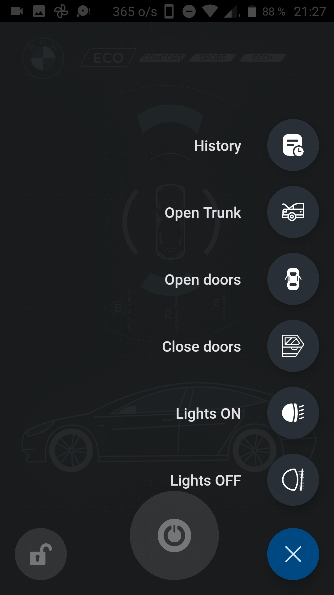
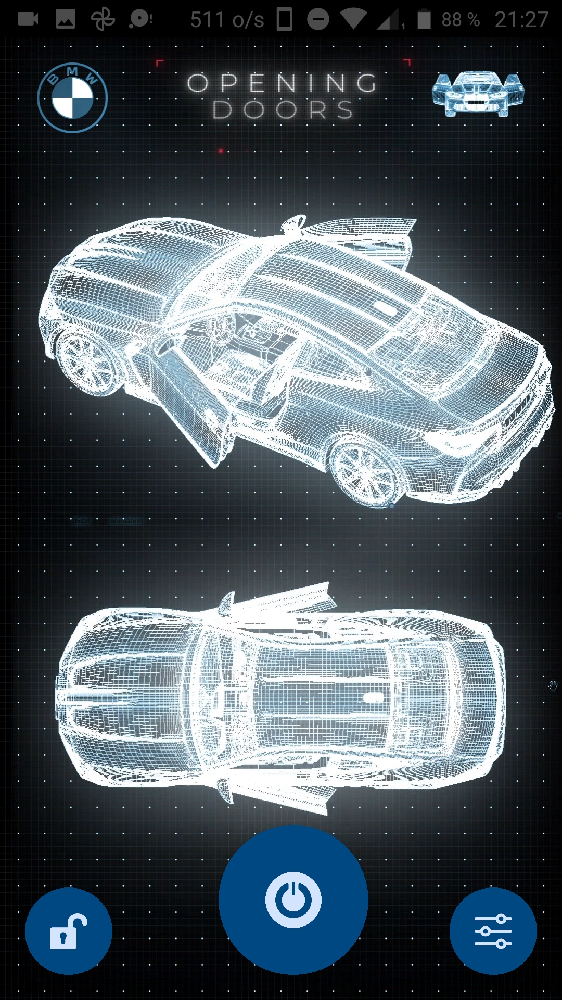
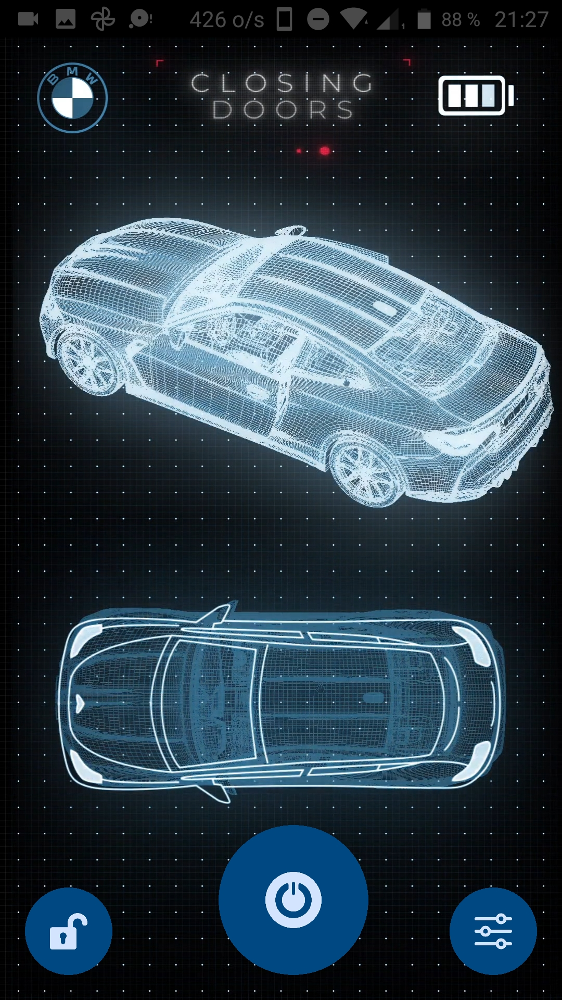
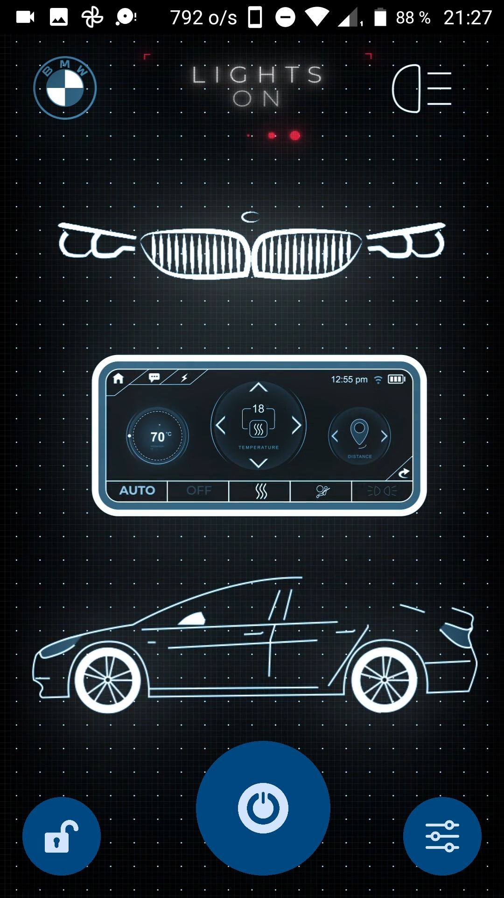

<p align="center">
    
</p>

# BMW CONNECT

## Disclaimer

The code for this project is classified and not publicly accessible. Therefore, the repository does not contain any code. Please reach out to the project lead for further inquiries.

## Project Overview
The BMW CONNECT project integrates a [mobile application](https://github.com/Sami-Souissi/BMW_CONNECT-APP-)
 and a [dashboard](https://github.com/Sami-Souissi/BMW_CONNECT-Dashboard-)
, both of which are interconnected to provide users with a comprehensive and intuitive experience in controlling a simulated BMW vehicle. The mobile app, developed using the React Native framework, facilitates seamless user authentication and access to the vehicle system. On the other hand, the dashboard, hosted on a Raspberry Pi 4, serves as the central control unit, enabling real-time monitoring and synchronization with the mobile app. The project emphasizes a futuristic, neon-inspired design, incorporating a customized BMW branding identity for both the app and the dashboard.

## Preview

<details>
  <summary>Click to expand for more images</summary>

  
  
  
  <div style="text-align:center;">
  <table style="margin: 0 auto;">
    <tr>
      <td> 
      </td>
      <td>
      </td>
    </tr>
     <tr>
      <td> 
      </td>
      <td>
      </td>
    </tr>
  </table>
  <table style="margin: 0 auto;">
    <tr>
      <td> 
      </td>
      <td>
      </td>
    </tr>
     <tr>
     <td>
      </td>
      <td> 
      </td> 
    </tr>
  </table>
</div>

</details>

## Table of Contents

- [Project Overview](#project-overview)
- [Features](#features)
- [Tech Stack](#tech-stack)
- [Usage](#usage)
- [Installation](#installation)
- [Credits](#credits)
- [License](#license)

---

# Project Overview

The BMW CONNECT mobile application is developed using the React Native framework, serving as a bridge to the local server hosted on a Raspberry Pi 4, which emulates the entire system of a BMW vehicle. The application prioritizes user experience, employing biometrics for seamless authentication and access to the vehicle system. Additionally, the app integrates a synchronized UI, enabling users to visualize real-time changes simultaneously displayed on the server's screen and the mobile app. With a focus on aesthetics and functionality, the app design embodies a futuristic, neon-inspired theme, customized with creative changes to align with the BMW brand's identity.

## Features

### User Interface

- Video splash screen
- Biometric-based login authentication
- Futuristic menu design with interactive elements
- Real-time synchronization with the server's display
- Glassmorphism UI design for a futuristic appeal

### User Actions

Once authenticated, users can perform the following actions:

- Control the vehicle's state (lock/unlock)
- Start/stop the engine
- Open/close doors and trunk
- Toggle lights on/off
- Access the full log of actions and server responses

## Tech Stack

### App


- React Native
- TypeScript
- @babel/core
- @react-native-firebase
- axios
- react-native-biometrics
- react-native-elements
- react-native-fast-image
- react-native-modal
- react-native-paper
- react-native-safe-area-context
- react-native-sensitive-info
- react-native-vector-icons
- react-native-video
- react-native-webview
- socket.io-client
- superagent

## Usage

### New User Registration

New users can connect to the server hosted on the Raspberry Pi via Wi-Fi. They can then scan the QR code displayed on the signup page of the web interface. This action redirects them to a download page for the mobile app. Upon installation, users can sign up using a username and password, linked to their device's biometrics through React Native biometrics.

## Installation

To run this project locally, follow these steps:

1. Clone this repository.
2. Install all the dependencies using `npm install`.
3. Run the development server using `npm start`.

```bash
$ git clone https://github.com/username/repo-name.git
$ cd repo-name
$ npm install
$ npm start
```

## Credits

This project was created for Primatek, utilizing a customized BMW branding identity for a visually appealing and functional interface design.

<p align="center">
    
</p>

## License

This project is licensed under the [MIT License](https://opensource.org/licenses/MIT). See the `LICENSE` file for more information.


